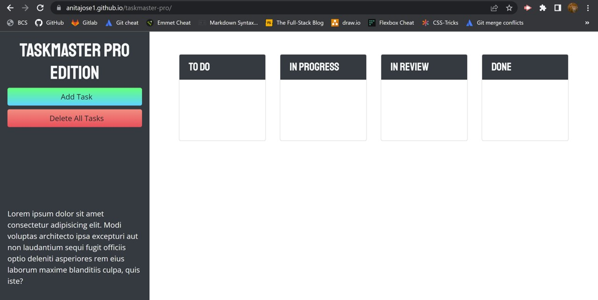

# Taskmaster Pro

## Description

Taskmaster Pro is a task-management application. The app comes with the following nifty features:

* Users can create tasks with descriptions and due dates.
* Task data is persistent.
* The Delete All button can delete tasks. 

The Taskmaster app runs in the browser and features dynamically updated HTML and CSS powered by JavaScript code. The app incorporates third-party libraries like jQuery and Bootstrap. 

The deployed application can be viewed at: https://anitajose1.github.io/taskmaster-pro/

